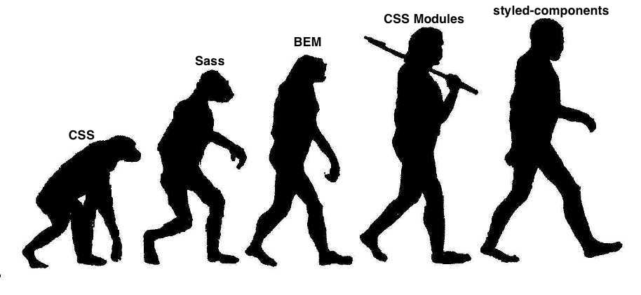

CSS has been the ugly step-sister of the development world. Many developers say:
"I'm a developer, I don't care how things look!". Bottom line, since they don't
care about how things look, they don't care to learn CSS. They should.
Developers should learn CSS to know how an application should be styled and
provide responsive support. One caveat: CSS is hard. It can take years to be
proficient.

There have been many attempts over the years to improve the quirks of CSS.
Out-of-the-box, CSS doesn't support variables (custom properties have been
introduced in newer browsers), loops, or functions. Preprocessors like
[Sass](http://sass-lang.com/) and [LESS](http://lesscss.org/) add useful
features. [BEM](http://getbem.com/), ITCSS, SMACSS also help; however, they are
optional and cannot be enforced at the language or tooling level.

# CSS-in-JS

Christopher Chedeau, a.k.a. [vjeux](https://twitter.com/Vjeux), in his famous
[CSS in JS](https://speakerdeck.com/vjeux/react-css-in-js) talk, lists some
issues with CSS. A few issues include global namespacing, styling conflicts, and
dead code. During the past few years, developers have been looking for ways to
improve CSS modularity. React, with a focus on building component-based user
interfaces, started the wave of CSS-in-JS libraries.

So, what is CSS-in-JS? Rather than include CSS style sheets, all your CSS is
written in JavaScript. According to
[Radium](https://github.com/FormidableLabs/radium)’s website (another library
for inline component styling) the benefits of using inline component styling
are:

* Scoped styles without selectors. CSS has just one global namespace which may
  cause collisions in large applications. Unique class names are created to
  avoid collisions.
* Avoids specificity conflicts. Two style definitions for one element can be
  used.
* Source order independence. No need to worry about how the order of files is
  imported.
* Dead code elimination. Linters will show unused components so they can be
  removed if not used.
* Vendor prefixing. Adds vendor prefixes only for the required browser.
* Highly expressive which makes reading JSX easier.

There are dozens of CSS-in-JS libraries available and more are released each
week. Popular libraries include:
[styled-components](https://www.styled-components.com/),
[glamorous](https://github.com/paypal/glamorous),
[emotion](https://github.com/emotion-js/emotion),
[radium](https://github.com/FormidableLabs/radium), and
[styled-jss](https://github.com/cssinjs/styled-jss). In this blog post, we are
going to review one of the more popular component-based CSS-in-JS libraries,
[styled-components](https://www.styled-components.com/).

# Overview

styled-components was created by [Max Stoiber](https://twitter.com/mxstbr) and
[Glen Maddern](https://twitter.com/glenmaddern) as a successor to CSS Modules
and a new way of writing dynamic CSS for the "CSS folk." style-components
currently has more than 150 contributors and 11.5K stars on
[Github](https://github.com/styled-components/styled-components).
styled-components makes components the fundamental way to build a styled user
interface. styled-components avoids potential collisions by scoping styles to
the component. This approach builds a bridge between best practices that have
been applied for years — like BEM — and components.

styled-components are created by defining components using the ES6 template
literal notation. CSS properties can be added to the component as needed, just
like you would do normally using CSS. styled-components is just CSS, so it
supports media queries, pseudo-selectors, and nesting. These small components
can be easily reused and tested. When the JavaScript code is parsed,
styled-components will generate unique class names, and inject the CSS into the
DOM.

```javascript
const Title = styled.h1`
  font-size: 1.5em;
  text-align: center;
  color: palevioletred;
`;
```


# Installation

styled-components can be installed to a project using the following commands.

```javascript
// if using npm
npm install --save styled-components
```

```javascript
// if using yarn
yarn install styled-components
```

# Simple Example

For the sake of simplicity, we will be using
[StackBlitz](https://stackblitz.com/) to walk through the examples. StackBlitz
is an online VS Code IDE for Angular and React.
[Link](https://stackblitz.com/edit/react-ew1wzv) to all examples.

Navigate to [StackBlitz](https://stackblitz.com/) and start a new project using
React ES6.

* Add the styled-components library to your project. Expand Dependencies, type
   in `styled-components`, and hit the Enter key.
* Import styled-components by adding `import styled from 'styled-components'`
   to the top of the file.
* Add the following code above the class definition. In the code below, two
   styles are created. Wrapper is a section and Title is a h1.

```javascript
const Title = styled.h1`
  font-size: 1.5em;
  text-align: center;
  color: palevioletred;
`;

const Wrapper = styled.section`
  padding: 4em;
  background: papayawhip;
  font-family: Lato, sans-serif;
`;
```

* Now that we have our styled components created, it is time to add them to the
   render function. Replace the render function with the following code. As you
   can see, using actual component names, versus generic element names with
   classes, provides a nice benefit. styled-components will give you a more
   semantic component hierarchy by default.

```javascript
  render() {
    return (
      <Wrapper>
        <Title>
          Hello World, my name is Steve Pietrek!
        </Title>
      </Wrapper>
    );
  }
```

The code below lists all code changes for this example.

```javascript
import React, { Component } from "react";
import { render } from "react-dom";
import Hello from "./Hello";
import "./style.css";
import styled from "styled-components";

const Title = styled.h1`
  font-size: 1.5em;
  text-align: center;
  color: palevioletred;
`;

const Wrapper = styled.section`
  padding: 4em;
  background: papayawhip;
  font-family: Lato, sans-serif;
`;

class App extends Component {
  constructor() {
    super();
    this.state = {
      name: "React"
    };
  }

  render() {
    return (
      <Wrapper>
        <Title>Hello World, my name is Steve Pietrek!</Title>
      </Wrapper>
    );
  }
}

render(<App />, document.getElementById("root"));
```

# Composing Styles Example

One of my favorite features using styled-components is the ability to compose
new styles from existing components. styled-components allows you to pass any
component, not just DOM elements.

Let's go back to StackBlitz and enhance the project.

* We want to create a new Title component which has a different color, bold
   font, and increased font size. Copy the Title component markup and paste it
   below. No changes will be displayed in the output window.
* Rename the Title component to `TitleBold`.
* Unlike the previous styled components, we want to compose the TitleBold
   component from the Title component. Change `styled.h1` to `styled(Title)`.
* Update the CSS properties. Set font-size to 2.5em, font-weight to bold, and
   color to red. Again, no changes will be displayed in the output window.
* Finally, in the render function, change Title to TitleBold. The output window
   will update with your new changes.

```javascript
const TitleBold = styled(Title)`
  font-size: 2.5em;
  font-weight: bold;
  color: red;
`;
```

# Passing Properties Example

Since styled-components are components, it is possible to pass props to the
styled component. This allows flexibility in using our components.

Going back to our StackBlitz project, let's update our TitleBold and Wrapper
components to support changing the background and color CSS properties based on
a prop passed.

* Replace color with the following code in the TitleBold component.
* Replace background with the following code in the Wrapper component.

```javascript
const TitleBold = styled(Title)`
  font-size: 2.5em;
  font-weight: bold;
  color: ${props => (props.primary ? "black" : "red")};
`;

const Wrapper = styled.section`
  padding: 4em;
  background: ${props => (props.primary ? "white" : "papayawhip")};
  font-family: Lato, sans-serif;
`;
```

* If 'primary' is passed as a prop on Wrapper component, the background color
   will be set to white. If the prop is missing, the default background color
   will be papayawhip.
* If `primary' is passed as a prop on TitleBold component, the color will be
   set to black. If the prop is missing, the default background color will be
   red.
* Below is the render function passing primary as a prop on both components.
   Test adding/removing the primary prop from each component.

```javascript
  render() {
    return (
      <Wrapper primary>
        <TitleBold primary>
          Hello World, my name is Steve Pietrek!
        </TitleBold>
      </Wrapper>
    );
  }
```

# Browser State Styles Example

styled-components integrates many Sass features such as nested rules and browser
state styles (e.g. hover, active, focus). A common requirement is to change the
state of a component when hovered.

* In your StackBlitz project, find the TitleBold component.
* We want to add a black text shadow with a size of 2px on the text in
   TitleBold.
* Update the TitleBold component to include the following hover statement.

```javascript
const TitleBold = styled(Title)`
  font-size: 2.5em;
  font-weight: bold;
  color: ${props => (props.primary ? "black" : "red")};
  &:hover {
    text-shadow: 2px 2px black;
  }
`;
```

# Media Query Example

In the age of responsive design, it is important your components be responsive.
styled-components allow you to define media templates.

* In your StackBlitz project, find the TitleBold component.
* We want to reduce the size of the text to 1.5em and set the font weight to
   normal if the screen's width drops below 400px.
* Update the TitleBold component to include the following media query.

```javascript
const TitleBold = styled(Title)`
  font-size: 2.5em;
  font-weight: bold;
  color: ${props => (props.primary ? "black" : "red")};
  &:hover {
    text-shadow: 2px 2px black;
  }
  @media (max-width: 400px) {
    font-size: 1.5em;
    font-weight: normal;
  }
`;
```

# Tooling

Although you can use styled-components with no tooling, there are tools
available to improve the developer experience.

1. [Visual Studio Code](https://code.visualstudio.com/) is a new type of tool
   that combines the simplicity of a code editor with what developers need for
   their core edit-build-debug cycle. Code provides comprehensive editing and
   debugging support, an extensibility model, and lightweight integration with
   existing tools. Atom and WebStorm also have support for CSS-in-JS and
   styled-components.
1. [stylelint](http://stylelint.io/) - Lint your styled components with
   stylelint.
1. Visual Studio support extensions and two I use for development using
   styled-components include:
   * [CSS-in-JS](https://marketplace.visualstudio.com/items?itemName=paulmolluzzo.convert-css-in-js) -
     Provides CSS in JS autocompletion and converts kebab-case CSS to camelCase
     CSS and vice versa.
   * [vscode-styled-components](https://marketplace.visualstudio.com/items?itemName=jpoissonnier.vscode-styled-components) -
     Syntax highlighting for styled-components.
   * [stylelint](https://marketplace.visualstudio.com/items?itemName=shinnn.stylelint) -
     A Visual Studio Code extension to lint CSS/SCSS/Less with stylelint.
1. [Polished](https://polished.js.org/) - A lightweight toolset writing styles
   in JavaScript, but also use Sass-style helper functions and mixins.
1. [styled-components Ecosystem](https://www.styled-components.com/ecosystem) -
   Numerous links for components, grid systems, helpers, testing, and further
   reading articles/videos.

# Summary

Regardless of which CSS-in-JS library you choose, inline styling of components
offers lots of great features and should be considered when building out React
user interfaces. Using [styled-components](https://www.styled-components.com/)
in your React applications will allow your JSX to be easier to read and your
styling will become easier to manage. You will also gain the power of being able
to tie a component's state directly to its styling, all from within the
component itself. We covered some of the important features in this blog post;
however, styled-components has much more available. Please review their
[documentation](https://www.styled-components.com/docs) for additional
information.

[Leave Feedback](https://github.com/spietrek/Feedback/issues/new)
