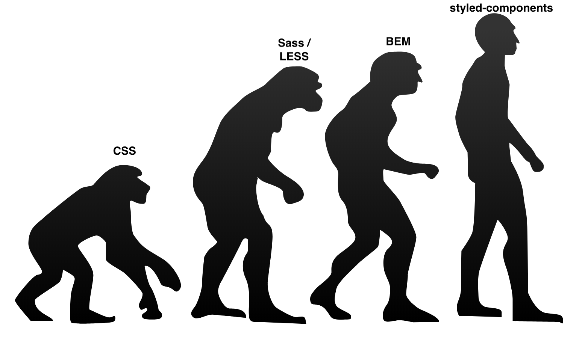
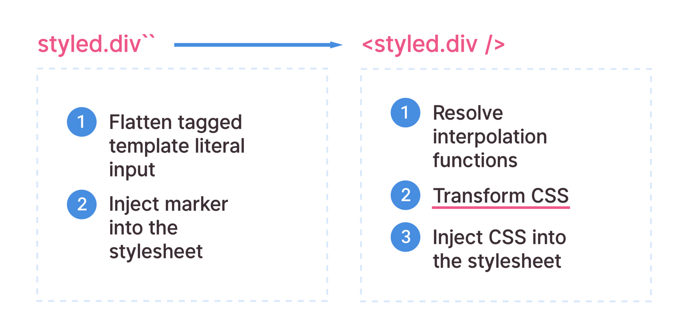

CSS has been the ugly step-sister of the development world. Many developers say: "I'm a developer, I don't care about how things looks.". Bottom line, they don't care to learn CSS. They should. Developers should know how an application should be styled. One caveat: CSS is hard. It can take years to be proficient. 

There have been many attempts over the years to improve the quirks of CSS. Out-of-the-box, CSS doesn't support variables, loops, or functions. Preprocessors like [Sass](http://sass-lang.com/) and [LESS](http://lesscss.org/) add useful features. [BEM](http://getbem.com/), ITCSS, SMACSS help; however, they are optional and cannot be enforced at the language or tooling level.

# CSS-in-JS

Christopher Chedeau, a.k.a. [vjeux](https://twitter.com/Vjeux), in his famous [CSS in JS](https://speakerdeck.com/vjeux/react-css-in-js) talk, lists some issues with CSS. A few include global namespacing, styling conflicts, and dead code. During the past few years, developers have been looking for ways to improve CSS modularity. React, with a focus on building component-based user interfaces, started the wave of CSS-in-JS libraries.

So, what is CSS-in-JS? Rather than include CSS style sheets, all your CSS is written in JavaScript. There are dozens of CSS-in-JS libraries available and more are added each day. Popular libraries include: [styled-components](https://www.styled-components.com/), [glamorous](https://github.com/paypal/glamorous), [emotion](https://github.com/emotion-js/emotion), and [styled-jss](https://github.com/cssinjs/styled-jss). In this blog post, we are going to review one of the popular component-based CSS-in-JS libraries, [styled-components](https://www.styled-components.com/).

# styled-components Overview

styled-components was created by [Max Stoiber](https://twitter.com/mxstbr) and [Glen Maddern](https://twitter.com/glenmaddern) as a successor to CSS Modules and a new way of writing dynamic CSS for the "CSS folk". style-components currently has more than 150 contributors and 11.5K stars on [Github](https://github.com/styled-components/styled-components). styled-components makes components the fundamental way to build a styled user interface. This approach builds a bridge between best practices that have been applied for years — like BEM, and components. styled-components avoids potential collisions by scoping styles to the component. 

Styled components are created by defining function components using the ES6 template literal notation. These small components can be easily reused and tested. CSS properties can be added to the component as needed just like you would do normally using CSS. When the JavaScript code is parsed, styled-components will generate unique class names, and apply them to the CSS style sheet.

```
const Title = styled.h1`
  font-size: 1.5em;
  text-align: center;
  color: palevioletred;
`;
```


# Installation

styled-components can be installed to project using the following commands.

```
// if using npm
npm install --save styled-components
```

```
// if using yarn
yarn install styled-components
```

# Simple Example

For the sake of simplicity, we will be using [StackBlitz](https://stackblitz.com/) to walk through the examples. StackBlitz is an online VS Code IDE for Angular and React.

Navigate to [StackBlitz](https://stackblitz.com/) and start a new project using React ES6.

1. Add the styled-components library to our project. Expand Dependencies, type in ```styled-components```, and hit the Enter key.
2. Import styled-components by adding ```import styled from 'styled-components'``` to the top of file.
3. Add the following code above the class definition. In the code below, two styles are created. Wrapper is a section and Title is a h1.

```
const Title = styled.h1`
  font-size: 1.5em;
  text-align: center;
  color: palevioletred;
`;

const Wrapper = styled.section`
  padding: 4em;
  background: papayawhip;
  font-family: Lato, sans-serif;
`;
```
4. Now that we have our styled components created, it is now time to add them to the render function. Replace the render function with the following code. As you can see, using actual component names, versus generic element names with classes, provides a nice benefit.

```
  render() {
    return (
      <Wrapper>
        <Title>
          Hello World, my name is Steve Pietrek!
        </Title>
      </Wrapper>
    );
  }
```

The code below lists all the changes listed above.

```
import React, { Component } from 'react';
import { render } from 'react-dom';
import Hello from './Hello';
import './style.css';
import styled from 'styled-components';

const Title = styled.h1`
  font-size: 1.5em;
  text-align: center;
  color: palevioletred;
`;

const Wrapper = styled.section`
  padding: 4em;
  background: papayawhip;
  font-family: Lato, sans-serif;
`;

class App extends Component {
  constructor() {
    super();
    this.state = {
      name: 'React'
    };
  }

  render() {
    return (
      <Wrapper>
        <Title>
          Hello World, my name is Steve Pietrek!
        </Title>
      </Wrapper>
    );
  }
}

render(<App />, document.getElementById('root'));
```

# Extending Styles Example

# Passing Properties Example

# Events Example

Sass support is built into styled-components.

# Media Query Example

# Tooling

https://polished.js.org/docs/

Furthermore, styled-components can be used with TypeScript or Flow.

[Leave Feedback](https://github.com/spietrek/Feedback/issues/new)
