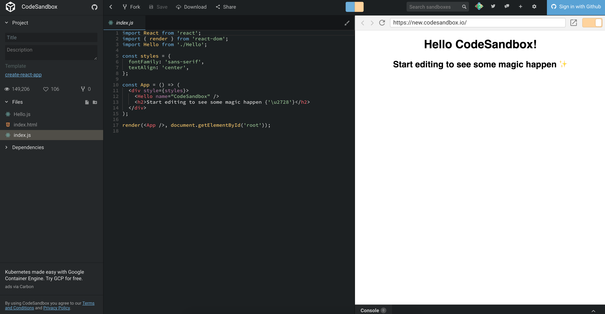

Over my career, I have been a developer IDE/Editor snob. I am always looking for the latest and greatest tools to use. Throughout the years, I have gone from using full IDE's to editors. Although IDE's provide lots of functionality (compared to editors), they are generally slower and provide too many features which I will never use.

I started my development career using [Borland Delphi](https://www.embarcadero.com/products/delphi). When I started at my current [employer](https://www.cardinalsolutions.com/), I was mainly a SharePoint developer, so I used [Visual Studio](https://www.visualstudio.com). Visual Studio was nice on its own; however, I fell in love with [ReSharper](https://www.jetbrains.com/resharper/) - Visual Studio add-in - as it did a great job pointing out mistakes and recommending improvements in my code.

During the past 5 years, I have transitioned to more of a front-end developer which has opened opportunities to use alternate development environments. Unlike full IDE's, like Visual Studio, these light-weight editors provided great performance and allowed me to focus on the features I needed. If a feature was unavailable, extensions could be added to provide additional functionality.

Although closer to an IDE, I started off using [WebStorm](https://www.jetbrains.com/webstorm/) and really enjoyed it until a new version came out which caused some DPI scaling issues with my Surface Pro. JetBrains quickly released a fix; however, I was already looking for alternatives as I wanted something more light-weight. I found [Brackets](http://brackets.io/) which I enjoyed using for a period of time. What I loved about Brackets was it was the first tool I used which provided the ability to add extensions to the editor. Beautify, Autoprefixer, Minifier, Brackets Gits, Emmet, and Live Reload opened my eyes to using extensions to provide a great developer UX and provide personalization. [Atom](https://atom.io/) was soon released and I made another editor move. Atom's extension ecosystem was huge and I found many extensions and themes to use. There was also an increase in editor plugins focused on a specific technology (e.g. React and React Native).

# VS Code

[Visual Studio Code](https://code.visualstudio.com/) is an open-source source code editor written by Microsoft and released in April 2015. Over the course of almost 3 years, VS Code has become one of the most used editors. In the [State of JavaScript 2017 Survey](https://stateofjs.com/2017/other-tools/), VS Code has the highest number of users. At this point (December 2017), VS Code has close to 500 contributors on [GitHub](https://github.com/Microsoft/vscode). The contributors do a great job of releasing new functionality every month. One feature I am definitely looking forward to is [Live Share](https://code.visualstudio.com/blogs/2017/11/15/live-share). Live Share will enable developers to collaborate in real-time on the same codebase without the need to synchronize code or to configure the same development tools, settings, or environment. Wow!

# My Favorite Extensions and Themes

I kicked the tires with VS Code when it was first released; however, I didn't fully commit to it as my main editor until third-party extensions were available. I have been using VS Code for over a year (an eternity for me) and would be hard-pressed to switch at this point. It provides great performance and the extension ecosystem is huge. I use the standard build the majority of the time. I would prefer to use the Insider's Build; however, I continually run into issues with very high CPU %. 

Below is a list of extensions, plugins, and themes I have installed.

## Extensions

Below is a list of my favorite VS Code extensions.

* [Auto Close Tag](https://marketplace.visualstudio.com/items?itemName=formulahendry.auto-close-tag)
* [Auto Rename](https://marketplace.visualstudio.com/items?itemName=formulahendry.auto-rename-tag)
* [Auto-Open Markdown](https://marketplace.visualstudio.com/items?itemName=hnw.vscode-auto-open-markdown-preview)
* [Bookmarks](https://marketplace.visualstudio.com/items?itemName=alefragnani.Bookmarks)
* [Bracket Pair Colorizer](https://marketplace.visualstudio.com/items?itemName=CoenraadS.bracket-pair-colorizer)
* [change-case](https://marketplace.visualstudio.com/items?itemName=wmaurer.change-case)
* [Code Metrics](https://marketplace.visualstudio.com/items?itemName=kisstkondoros.vscode-codemetrics)
* [CSS-in-JS](https://marketplace.visualstudio.com/items?itemName=paulmolluzzo.convert-css-in-js)
* [Debugger for Chrome](https://marketplace.visualstudio.com/items?itemName=msjsdiag.debugger-for-chrome)
* [Docker](https://marketplace.visualstudio.com/items?itemName=PeterJausovec.vscode-docker)
* [ESLint](https://marketplace.visualstudio.com/items?itemName=dbaeumer.vscode-eslint)
* [Git Lens](https://marketplace.visualstudio.com/items?itemName=eamodio.gitlens)
* [Import Cost](https://marketplace.visualstudio.com/items?itemName=wix.vscode-import-cost)
* [Intellisense for CSS class names](https://marketplace.visualstudio.com/items?itemName=Zignd.html-css-class-completion)
* [JavaScript (ES6) code snippets](https://marketplace.visualstudio.com/items?itemName=xabikos.JavaScriptSnippets)
* [markdownlint](https://marketplace.visualstudio.com/items?itemName=DavidAnson.vscode-markdownlint)
* [Node Debug 2](https://marketplace.visualstudio.com/items?itemName=ms-vscode.node-debug2)
* [Parker CSS Analysis](https://marketplace.visualstudio.com/items?itemName=raymondcamden.parker-code-extension)
* [Path Intellisense](https://marketplace.visualstudio.com/items?itemName=christian-kohler.path-intellisense)
* [Prettier](https://marketplace.visualstudio.com/items?itemName=esbenp.prettier-vscode) - Love, love, love [Prettier](https://www.twitter.com/prettiercode)
* [React Native Tools](https://marketplace.visualstudio.com/items?itemName=vsmobile.vscode-react-native)
* [Reactjs code snippets](https://marketplace.visualstudio.com/items?itemName=xabikos.ReactSnippets)
* [Settings Sync](https://marketplace.visualstudio.com/items?itemName=Shan.code-settings-sync) - Must extension for syncing between different laptops
* [Sort](https://marketplace.visualstudio.com/items?itemName=henriiik.vscode-sort)
* [stylelint](https://marketplace.visualstudio.com/items?itemName=shinnn.stylelint)
* [TSLint](https://marketplace.visualstudio.com/items?itemName=eg2.tslint)
* [vscode-icons](https://marketplace.visualstudio.com/items?itemName=robertohuertasm.vscode-icons)
* [vscode-styled-components](https://marketplace.visualstudio.com/items?itemName=jpoissonnier.vscode-styled-components)

## My Favorite Themes

Below is a list of my favorite VS Code themes.

* [Winter is Coming Theme](https://marketplace.visualstudio.com/items?itemName=johnpapa.winteriscoming) - My favorite theme
* [Atom One Dark Syntax Theme](https://marketplace.visualstudio.com/items?itemName=andischerer.theme-atom-one-dark)
* [One Dark Pro](https://marketplace.visualstudio.com/items?itemName=zhuangtongfa.Material-theme)

# Summary

Regardless of which IDE or editor you use for development, there are plenty of great options available. All provide great personalization by allowing you to install extensions and themes.

Who knows, with how far online editors have come, (e.g. [StackBlitz](https://stackblitz.com/) and [CodeSandbox](https://codesandbox.io/)), we may all be developing entirely online soon.

*Hmm. A great feature to would be integration between your editor and an online editor.*

[Leave Feedback](https://github.com/spietrek/Feedback/issues/new)
